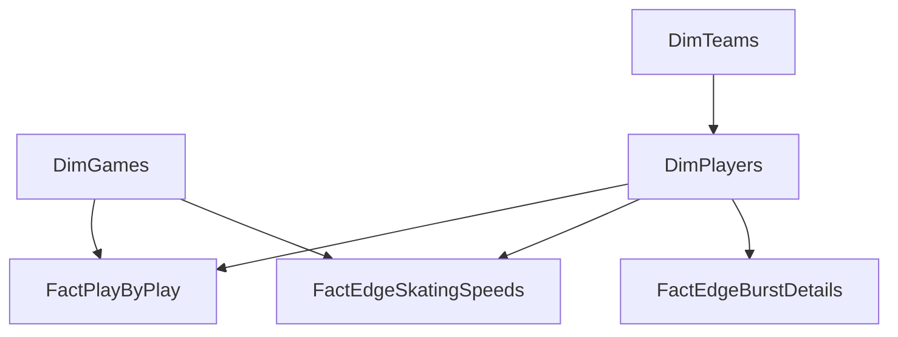

# 🗄️ Schema Architecture & Data Graph

**Storage Engine:** Power BI VertiPaq (In-Memory Columnar Database)
**Format:** TMDL (Tabular Model Definition Language)

## 1. High-Level Topology
*(Updated to reflect strict cascading filters and removal of ambiguous paths)*

## 2. Dimension Tables (Lookups)

### `DimGames`
* **Purpose:** Unified tracking of all games (Live API + Historical Kaggle).
* **Fields:** `GameID` (PK), `Season`, `GameType`, `GameDate`, `HomeTeamID`, `AwayTeamID`.

### `DimTeams`
* **Purpose:** The Digital Rolodex for franchises. 
* **Fields:** `TeamID` (PK), `FranchiseID`, `TeamName`, `TeamAbbrev`, `TeamLogoURL`, `Conference`, `Division`, `LeagueRank`, `Points`, `GoalDifferential`, `StreakType`, `StreakCount`.

### `DimPlayers`
* **Purpose:** Active roster dictionary.
* **Fields:** `PlayerID` (PK), `PlayerName`, `Position`, `ShootsCatches`, `GamesPlayed`, `Goals`, `Assists`, `Points`, `CurrentTeamAbbrev` (FK to DimTeams), `HeadshotURL`.

## 3. Fact Tables (Events & Telemetry)

### `FactPlayByPlay` (DAX UNION Table)
* **Purpose:** The core event ledger. Unifies `FactLivePlays` and `FactHistoricalPlays`.
* **Fields:** `GameID` (FK), `EventID`, `PeriodNumber`, `TimeInPeriod_Seconds`, `EventType`, `EventTeamID`, `X_Coord`, `Y_Coord`, `ScoringPlayerID` (FK), `ShootingPlayerID` (FK), `HittingPlayerID` (FK), `HitteePlayerID` (FK).

### `FactEdgeSkatingSpeeds`
* **Purpose:** Player telemetry for top speeds.
* **Fields:** `PlayerID` (FK), `skatingSpeed.imperial`, `skatingSpeed.metric`, `periodDescriptor.number`, `homeTeam.abbrev`.

### `FactEdgeBurstDetails`
* **Purpose:** Player telemetry for acceleration and league comparisons.
* **Fields:** `PlayerID` (FK), `SkatingSpeedDetails.maxSkatingSpeed.imperial`, `SkatingSpeedDetails.maxSkatingSpeed.leagueAvg.imperial`, `burstsOver22`, `bursts20To22`, `bursts18To20`.

## 4. DAX Measures (`_Measures` Table)
* **Purpose:** Centralized repository for all explicit DAX calculations to prevent model scattering.
* **Metrics:** Covered in `MEASURE_DICTIONARY.md`
