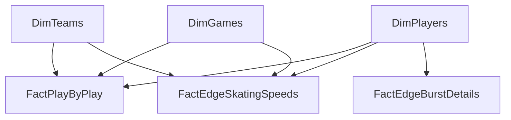

# 🗄️ Schema Architecture & Data Graph

**Storage Engine:** Power BI VertiPaq (In-Memory Columnar Database)
**Format:** TMDL (Tabular Model Definition Language)

## 1. High-Level Topology

## 2. Dimension Tables (Lookups)

### `DimGames`
* **Purpose:** Unified tracking of all games (Live API + Historical Kaggle).
* **Fields:** `GameID` (PK), `Season`, `GameType`, `GameDate`, `HomeTeamID`, `AwayTeamID`.

### `DimTeams`
* **Purpose:** The Digital Rolodex for franchises. Built via a Left Outer Join of the legacy Stats API (for historical IDs) and the live Standings API.
* **Fields:** `TeamID` (PK), `TeamName`, `TeamAbbrev`, `TeamLogoURL`, `Conference`, `Division`, `LeagueRank`, `Points`, `GoalDifferential`, `StreakType`, `StreakCount`.

### `DimPlayers`
* **Purpose:** Active roster dictionary.
* **Fields:** `PlayerID` (PK), `PlayerName`, `Position`, `ShootsCatches`, `HeadshotURL`.

## 3. Fact Tables (Events & Telemetry)

### `FactPlayByPlay` (DAX UNION Table)
* **Purpose:** The core event ledger. Unifies `FactLivePlays` and `FactHistoricalPlays`.
* **Fields:** `GameID` (FK), `EventID`, `PeriodNumber`, `TimeInPeriod_Seconds`, `EventType`, `EventTeamID` (FK), `X_Coord`, `Y_Coord`, `ScoringPlayerID` (FK), `ShootingPlayerID` (FK).

### `FactEdgeSkatingSpeeds`
* **Purpose:** Player telemetry for top speeds.
* **Fields:** `PlayerID` (FK), `skatingSpeed.imperial`, `skatingSpeed.metric`, `periodDescriptor.number`.

### `FactEdgeBurstDetails`
* **Purpose:** Player telemetry for acceleration and league comparisons.
* **Fields:** `PlayerID` (FK), `max.imperial`, `max.percentile`, `leagueAvg.imperial`, `burstsOver22`.

## 4. DAX Measures (`_Measures` Table)
* **Purpose:** Centralized repository for all explicit DAX calculations to prevent model scattering.
* **Metrics:** * `Team Points`: `SUM('DimTeams'[Points])`
  * `Team Goal Diff`: `SUM('DimTeams'[GoalDifferential])`
  * `Current Streak`: Uses `ISINSCOPE` to restrict streak rendering to the lowest Team hierarchy level.
